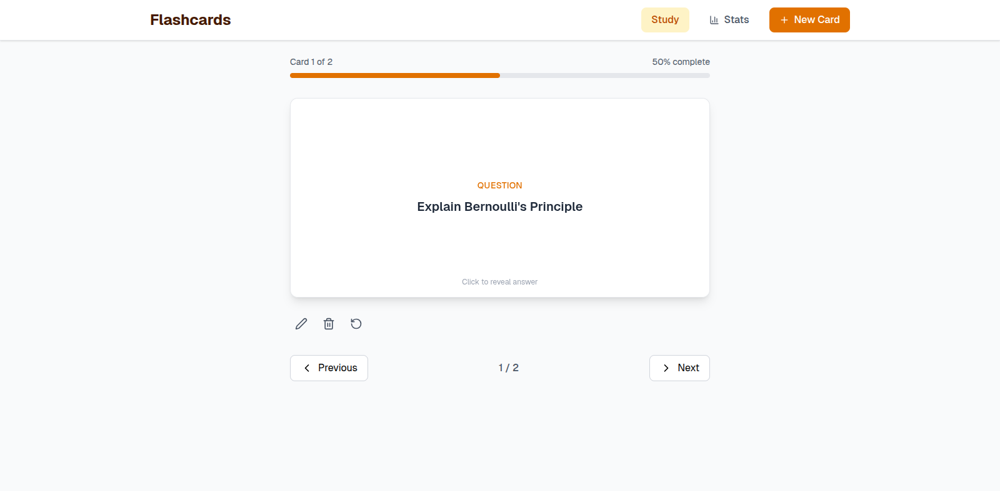

# Flashcards App

## Tech Stack
1. React + Vite
2. TailwindCSS

## Features
1. Create, edit, delete and update flashcards.
2. Store flashcards in localStorage.
3. View flashcard stats

## How to run
1. Clone or download the repository
2. Install dependencies
3. Start dev server with `npm dev` on `http://localhost:5173`

Project video available on my channel: [tsbsankara](https://youtube.com/@tsbsankara)
